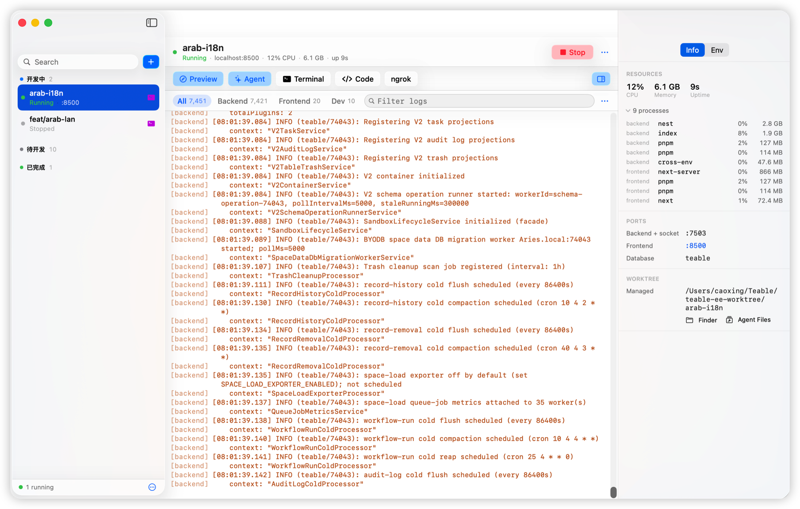

# TeaBranch

A macOS app for running several branches of [Teable](https://github.com/teableio/teable) at once, each in its own Git worktree with its own dev server, ports, database and environment. Native SwiftUI + AppKit on Liquid Glass — no web view, no Rust, no Node runtime.


<p align="center">
  
</p>

## What is TeaBranch?

Teable is a large full-stack project, and switching branches means restarting everything. TeaBranch keeps each branch permanently checked out in its own worktree, so switching is a click and nothing has to restart. The window is built around the fact that several of them run at the same time: a sidebar that always shows every branch and what it is doing, a detail pane for the one you are reading, and an inspector for the reference material.

### Features

**Worktrees**

- One-click creation — makes the worktree, generates an isolated `.env.development.local`, installs dependencies, provisions the database and runs migrations
- Ports are allocated in blocks and reuse the gaps left by deleted worktrees, skipping ports that predictably belong to something else (Postgres, Redis, macOS AirPlay's 5000 and 7000) rather than only ones that happen to be free at that second
- Databases can be created fresh, cloned from another worktree, or shared with one — a branch cut from `develop` usually just wants develop's data

**Running them**

- Start and stop each branch independently; different branches never block each other
- **Stop actually stops.** It kills by process group *and* by port, waits until the ports are genuinely free, and tells you which PID is still holding one when they are not
- Health watchdog supervises by *port*, not just by PID, so a dev-server wrapper that outlives its crashed inner app gets restarted instead of sitting there looking alive
- Orphan recovery reattaches to dev servers still running after a force-quit, and reports their resource usage even though it did not start them
- Per-branch CPU, memory, uptime and process list, from the process group each command leads

**Reading the output**

- A real text console: selection spans lines, ⌘A and ⌘C work, and search highlights in place with ⏎ / ⇧⏎ stepping through hits
- Per-source tabs (backend, frontend) with ANSI colour, wrapped lines hanging under the message
- The slow parts of a start — reclaiming ports, `pnpm install`, provisioning the database — narrate themselves instead of leaving you on "Waiting for output…"

**Working on them**

- **Agent** opens a terminal tab in the worktree with Claude Code already running
- **Terminal** and **Code** open the worktree in your terminal or VS Code. With [Otty](https://otty.app) this goes through its control CLI: no Accessibility permission, it can start a command for you, and the sidebar can show which worktrees already have a tab open
- **Preview** opens the branch on a `<branch>.localhost` subdomain, so each one gets its own cookie jar
- **Agent Files** opens what Claude Code generated for that worktree
- Edit any variable in the worktree's env file, not just the ones TeaBranch generates; saving restarts the branch, because a dev server reads its environment once, at exec
- ngrok tunnel per branch, written back into its env file

## Install

Grab `TeaBranch-<version>-arm64.dmg` from [Releases](https://github.com/caoxing9/TeaBranch/releases) and drag it to Applications.

Requires **macOS 26 or later on Apple Silicon**. The interface is built on Liquid Glass — `glassEffect`, `GlassEffectContainer`, `.buttonStyle(.glass)` — which has no back-deployment path, so there is no Intel build and no older-macOS build.

The build is **ad-hoc signed and not notarized**, so macOS quarantines it on first launch. Either right-click → Open, or:

```bash
xattr -d com.apple.quarantine /Applications/TeaBranch.app
```

Escaping that step needs a paid Apple Developer ID.

## Build from source

```bash
git clone git@github.com:caoxing9/TeaBranch.git
cd TeaBranch/swift
./scripts/build_app.sh          # → build/TeaBranch.app
./scripts/build_app.sh --dmg    # + build/TeaBranch-<version>-arm64.dmg
open build/TeaBranch.app
```

Requirements: macOS 26+ and a Swift 6.2 toolchain. Command Line Tools are enough — there is no
Xcode project, and nothing in the build path needs `xcodebuild`.

See [swift/README.md](swift/README.md) for the source layout, the terminal-integration matrix, and
the things worth knowing before touching the process, port or descriptor handling.

## Usage

1. **Pick a repository** — on first launch, choose the Teable Git repository
2. **Create a worktree** — ⌘N. It defaults to reusing `develop`'s database, which is what a branch cut from develop almost always wants and which skips the slowest steps
3. **Start a branch** — Start spins up its dev servers on its own ports
4. **Read the logs** — they fill the detail pane; ⌘F filters, and selection crosses lines
5. **Work on it** — Agent, Terminal or Code open the worktree; Preview opens it in a browser
6. **Inspect it** — the trailing panel has resources, ports, database and worktree on one tab, and every environment variable on the other
7. **Organise** — right-click → Move to, to shift a branch between lanes; lane sections fold away
8. **Delete** — right-click → Delete Worktree. Confirms once, because nothing undoes it
9. **Menu bar** — closing the window hides it and the app keeps running; the icon shows how many branches are live

## How worktree isolation works

Creating a worktree through TeaBranch:

1. **Fetches** the latest `origin/develop`
2. **Creates** a Git worktree in a sibling directory (`<repo>-worktree/<branch-name>`)
3. **Generates** a `.env.development.local` with a unique port block, a database and a Redis DB index
4. **Installs** dependencies via `pnpm install`
5. **Provisions** the database — new, cloned, or shared with another worktree
6. **Runs** migrations

Ports come from a "slot" that fixes the whole block (`3000 + slot*100`). Slot assignment ignores
the `# WORKTREE_SLOT=` markers and reads the real port values off disk, because the two drift apart
whenever a derived port was already taken — trusting the marker hands the same port to two
worktrees, which then kill each other's dev servers. It searches from the first slot rather than
from `max + 1`, so a deleted worktree's block gets reused instead of the range creeping upward
forever.

## Configuration

Settings live in `~/Library/Application Support/com.teabranch.dev/settings.json`, and the ones
worth changing are in the Settings sheet (⌘,).

| Setting | Default | Description |
|---------|---------|-------------|
| `projectPath` | — | Root Git repository path |
| `basePort` | `3001` | Where port allocation starts looking |
| `defaultStartCommand` | `npm run dev` | Fallback when `package.json` names no dev script |
| `terminalApp` | Otty, when installed | Terminal to open worktrees in |
| `agentCommand` | `claude --dangerously-skip-permissions` | What the Agent button runs. Spelled out rather than named: a terminal starts this where your shell aliases do not exist |

Lane assignments live alongside it in `categories.json`.

## Contributing

1. Fork the repository
2. Create your feature branch (`git checkout -b feature/amazing-feature`)
3. Commit your changes — the repo uses [Conventional Commits](https://www.conventionalcommits.org/); `feat:` and `fix:` drive the release version
4. Push to the branch (`git push origin feature/amazing-feature`)
5. Open a Pull Request — CI builds the app, so a compile error can't land

## License

MIT
